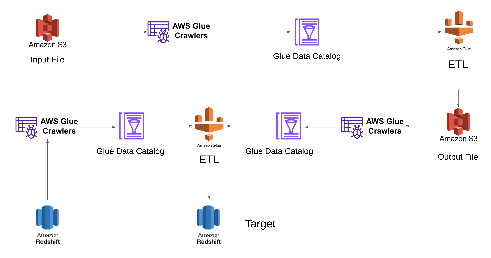
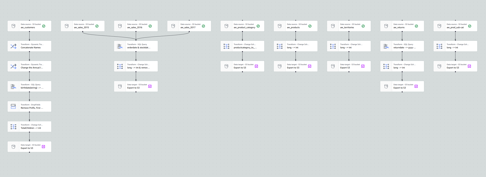
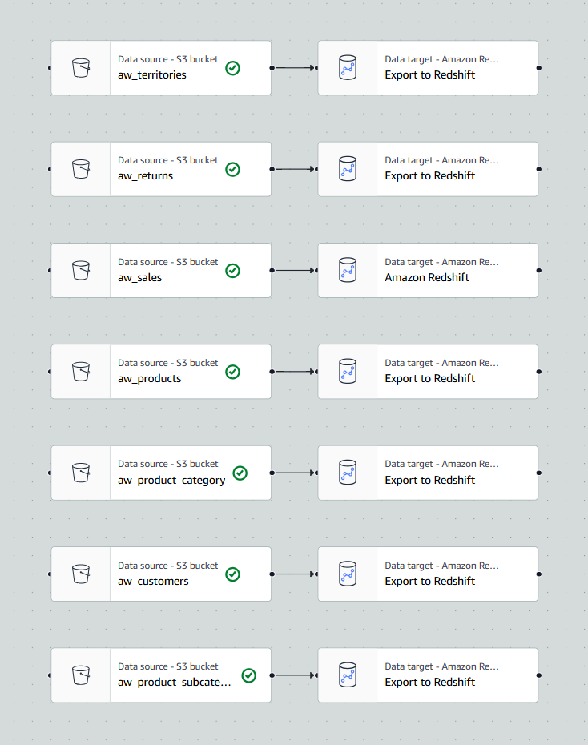

# 🧱 AWS Data Engineering ETL Pipeline Project

This project demonstrates a complete data engineering workflow using AWS services to ingest, transform, and load data from Kaggle into AWS Redshift via AWS S3 and AWS Glue. The architecture is designed to automate metadata extraction, data transformation, and loading processes.

---

## 📊 Dataset

The dataset used for this project is the [Adventure Works Sales Dataset](https://www.kaggle.com/datasets/ukveteran/adventure-works) from Kaggle. It contains several CSV files capturing sales data for analysis.

---

## 🛠️ Tools and Technologies

- **Amazon S3**: Cloud storage used to store raw and processed data.
- **AWS Glue Crawler**: Extracts schema metadata from both raw and processed files.
- **AWS Glue ETL**: Transforms and cleans the dataset using Visual ETL and  PySpark.
- **Glue Data Catalog**: Central metadata repository for Glue jobs and Redshift.
- **Amazon Redshift**: Cloud data warehouse for structured analytics-ready data.
- **Boto3**: Python SDK for AWS used for uploading data to S3.
- **Kaggle Python module**: For programmatically downloading datasets.

---

## 🧩 Architecture Overview

---

## 🔄 Workflow Breakdown

### 1. Data Ingestion

- The dataset is programmatically downloaded using the `kaggle` module.
- Extracted CSV files are uploaded to an Amazon S3 bucket using the `boto3` library.

  [👉Data Ingestion Python Script](Scripts/Kaggle_to_S3_using_boto3.ipynb)

### 2. Metadata Extraction with AWS Glue Crawler

- A Glue crawler is configured to scan the raw CSV files in S3.
- The crawler creates table definitions and stores them in the Glue Data Catalog.

### 3. Data Transformation with AWS Glue ETL

- An AWS Glue job reads the raw data using the metadata from the Glue Data Catalog.
- The job performs data cleaning and transformation using PySpark (e.g., handling null values, type casting).
- The transformed data is written to a new location in Amazon S3 (processed zone).

  [👉ETL Script](Scripts/AW_ETL_Job.ipynb)

  

### 4. Processed Data Cataloging

- A second AWS Glue crawler is set up to crawl the cleaned data from the processed S3 location.
- New metadata is registered in the Glue Data Catalog under a different database.

### 5. Target Redshift Setup

- A Redshift cluster is created.
- Using `boto3` library, empty Redshift tables are generated to match the schema of the cleaned data.

  [👉Target Redshift Setup Python Script](Scripts/Redshift_Table_Creation_ETL_Job.ipynb)

### 6. Final ETL to Redshift

- A final AWS Glue ETL job is configured to:
  - Use the Glue Data Catalog of cleaned S3 data as the source.
  - Use the Redshift table metadata as the target.
  - Load the processed data from S3 into the corresponding Redshift tables.

  [👉Data Ingestion from S3 to Redshift Script](Scripts/Load_From_S3_to_Redshift_ETL_Job.ipynb)

  

---

## 🎯 TL;DR

- Raw CSVs from Kaggle are transformed into structured data.
- ETL Job performed on Raw Data and Stored in S3 in Parquet Format.
- Data is securely stored in S3 and loaded into Amazon Redshift.
- Redshift now contains clean, analytics-ready datasets for BI tools and Reporting.

---

## 🚀 Future Enhancements

- Automate pipeline orchestration using AWS Step Functions or Apache Airflow.
- Integrate monitoring with Amazon CloudWatch.
- Connect Redshift to Power BI or QuickSight for visualization and reporting.

---
